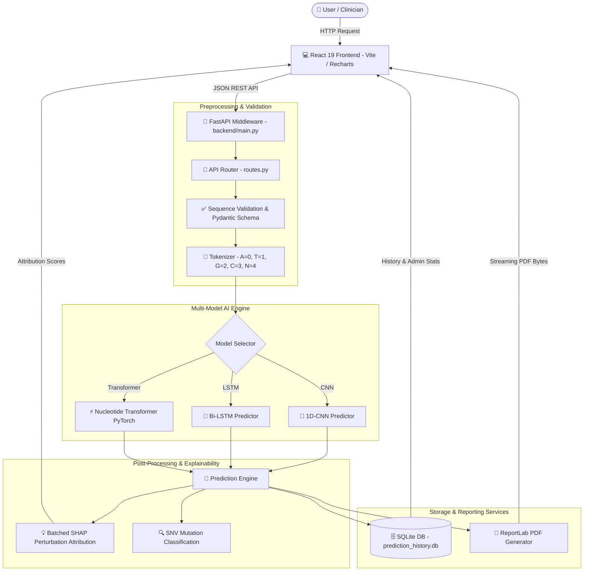
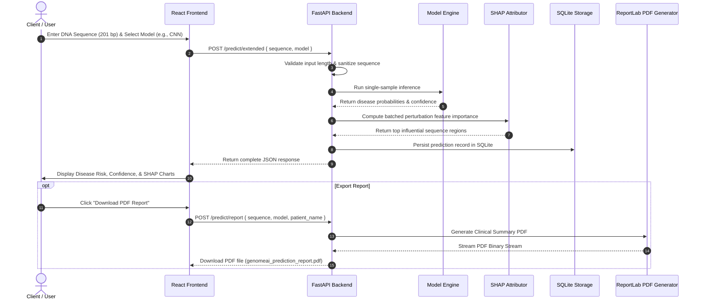

<div align="center">

# 🧬 GenomeAI

### *Next-Generation AI Framework for Genomic Disease Prediction & Variant Analysis*

[](https://python.org)
[](https://fastapi.tiangolo.com)
[](https://pytorch.org)
[](https://tensorflow.org)
[](https://react.dev)
[](https://sqlite.org)
[](LICENSE)

<br/>

```
      ___ ___ ___  ___  ___ ___ ___  ___ ___ 
     / __| __|   \|   \/   \_ _| _ \/ __| _ \
    | (_ | _|| |) | |) | - || ||  _/ (__|  _/
     \___|___|___/|___/|_|_|___|_|  \___|_|  
```

<br/>

*(Placeholder: [GenomeAI Platform Banner - High-Resolution Genomics & Deep Learning Visual])*

<br/>

[Key Features](#-key-features) • [Architecture](#-architecture) • [AI Models](#-ai-models) • [API Docs](#-api-documentation) • [Installation](#-installation) • [Usage](#-usage-guide)

</div>

---

## 📑 Table of Contents

- [📌 Project Overview](#-project-overview)
- [✨ Key Features](#-key-features)
- [🏗️ Architecture](#️-architecture)
- [📂 Folder Structure](#-folder-structure)
- [🔄 Workflow](#-workflow)
- [🛠️ Technology Stack](#️-technology-stack)
- [🤖 AI Models](#-ai-models)
- [📊 Dataset & Data Pipeline](#-dataset--data-pipeline)
- [📡 API Documentation](#-api-documentation)
- [🖼️ Screenshots](#️-screenshots)
- [⚙️ Installation](#️-installation)
- [🚀 Usage Guide](#-usage-guide)
- [📈 Performance Benchmark](#-performance-benchmark)
- [🧪 Testing](#-testing)
- [⭐ Project Highlights](#-project-highlights)
- [🔮 Future Improvements](#-future-improvements)
- [🧩 Challenges Faced](#-challenges-faced)
- [🎓 Learning Outcomes](#-learning-outcomes)
- [🤝 Contributing](#-contributing)
- [📜 License](#-license)
- [📬 Contact & Author](#-contact--author)
- [🙏 Acknowledgements](#-acknowledgements)

---

## 📌 Project Overview

### The Genomic Data Challenge
Modern next-generation sequencing (NGS) produces billions of nucleotide base pairs daily. However, translating raw DNA sequences into clinical disease risk predictions remains a critical bottleneck. Traditional bioinformatic pipelines rely on static database lookups that miss novel Single Nucleotide Variants (SNVs) and non-linear contextual sequence patterns.

### The GenomeAI Solution
**GenomeAI** bridges genomics and state-of-the-art deep learning. By treating DNA sequences as a biological language, GenomeAI leverages 1D Convolutional Neural Networks (1D-CNN), Bidirectional LSTMs (Bi-LSTM), and fine-tuned Genomic Transformers (`InstaDeepAI/nucleotide-transformer-v2-50m-multi-species`) to classify disease associations and identify critical pathogenic mutations directly from raw sequence windows.

```
Raw DNA Sequence ──► Tokenization ──► Multi-Model Engine ──► SHAP Attribution ──► Clinical PDF Report
```

### Real-World Applications
- **Clinical Genetics Support**: Assisting genetic counselors in interpreting unclassified variants.
- **Oncology & Precision Medicine**: Detecting pathogenic variant patterns linked to hereditary cancers.
- **Biomedical Research**: Accelerating biomarker discovery across 68,000+ curated genomic variants.

### Target Users
- **Bioinformaticians & AI Researchers**: Benchmark multi-architecture genomic deep learning models.
- **Clinicians & Medical Oncologists**: Access automated clinical summary reports with local SHAP feature attributions.
- **Software Engineers**: Integrate scalable, RESTful DNA inference APIs into healthcare pipelines.

---

## ✨ Key Features

| Feature | Category | Description |
| --- | --- | --- |
| 🧬 **DNA Sequence Upload** | Input | Flexible DNA string input supporting uppercase, lowercase, and FASTA sequence formats. |
| ✅ **DNA Validation** | Preprocessing | Strict nucleotide verification `[A, T, G, C, N]` with position-specific error handling. |
| 🔢 **DNA Tokenization** | Preprocessing | High-performance integer encoding mapping nucleotides `A=0, T=1, G=2, C=3, N=4`. |
| 🔍 **Mutation Detection** | Variant Analysis | SNV extraction comparing query sequences against consensus wild-types with impact scoring. |
| 🎯 **Multi-Model Inference** | AI Engine | Seamlessly switch between **1D-CNN**, **Bi-LSTM**, and **Nucleotide Transformer**. |
| 🧠 **1D-CNN Model** | Deep Learning | Fast local motif extraction using multi-stage 1D convolutions and spatial max pooling. |
| 🔁 **Bi-LSTM Model** | Deep Learning | Sequential context tracking for recurrent long-range nucleotide dependencies. |
| ⚡ **Transformer Model** | Foundation AI | Fine-tuned 50M parameter ESM/Nucleotide Transformer for self-attention feature extraction. |
| 📊 **Confidence Scoring** | Analytics | Multi-class probability distributions with confidence levels (*Very High, High, Moderate, Low*). |
| 💡 **Explainable AI (SHAP)** | XAI | Batched perturbation attribution identifying top-contributing nucleotide positions. |
| 🗄️ **SQLite History** | Storage | Thread-safe, indexed SQLite database for tracking prediction logs with full audit trails. |
| 📄 **Clinical PDF Reports** | Reporting | Automated ReportLab PDF synthesis featuring probability charts and clinical disclaimers. |
| 📈 **Dataset Analytics** | Service | Real-time GC content statistics, sequence length distributions, and class frequencies. |
| 🚀 **FastAPI Backend** | Infrastructure | Async REST API with OpenAPI documentation, Pydantic validation, and CORS support. |
| 💻 **React 19 Frontend** | UI / UX | Responsive dashboard featuring Recharts, Framer Motion, and particle visualizers. |
| 🛡️ **Input Sanitization** | Security | Enforced string payload constraints preventing Denial-of-Service (DoS) attacks. |

---

## 🏗️ Architecture

The system is structured as a decoupled, multi-tiered architecture enabling independent scaling of frontend visualizers, REST middleware, model predictors, and persistent database storage.



---

## 📂 Folder Structure

```
GenomeAI/
├── backend/
│   ├── main.py                     # FastAPI server entry point & CORS middleware
│   ├── api/
│   │   └── routes.py               # REST API route handlers (/predict, /report, /history)
│   ├── ai/                         # Machine learning model training scripts
│   │   ├── cnn_model.py            # 1D-CNN architecture & Keras training loop
│   │   ├── lstm_model.py           # Bi-LSTM architecture & Keras training loop
│   │   ├── transformer_train.py    # PyTorch fine-tuning loop for Nucleotide Transformer
│   │   ├── transformer_dataset.py  # PyTorch Dataset class
│   │   ├── transformer_utils.py    # Epoch training & validation utilities
│   │   ├── data_loader.py          # Training dataset splitter & class weighting
│   │   ├── class_weights.py        # Balanced class weight compute
│   │   ├── evaluate.py             # Classification metrics & confusion matrix
│   │   └── metrics.py              # Training loss/accuracy curve graph generator
│   ├── predictor/                  # Single-sample inference predictors
│   │   ├── predictor.py            # Master predictor facade
│   │   ├── cnn_predictor.py        # Optimized 1D-CNN tensor caller
│   │   ├── lstm_predictor.py       # Optimized Bi-LSTM tensor caller
│   │   └── transformer_predictor.py# PyTorch Transformer inference loader
│   ├── preprocessing/             # Genome index & sequence extraction
│   │   ├── dataset_builder.py      # Master dataset preparation script
│   │   ├── dna_tokenizer.py        # Base tokenization rules
│   │   ├── genome_loader.py       # FASTA genome reader
│   │   └── sequence_extractor.py   # Flanking sequence extractor around variant IDs
│   ├── services/                   # Business logic & reporting services
│   │   ├── analytics_service.py    # GC content & dataset analytics calculator
│   │   ├── benchmark_service.py    # Multi-model benchmarking suite
│   │   ├── explainability_service.py# Batched SHAP feature attribution
│   │   ├── model_loader.py         # Lazy model loader with error handling
│   │   ├── mutation_analysis.py    # Point mutation detector & classifier
│   │   ├── prediction_history.py   # SQLite persistence & stats aggregator
│   │   └── report_generator.py     # ReportLab PDF report generator
│   ├── utils/                      # Helper utilities
│   │   ├── disease_mapper.py       # Integer label to disease name lookup
│   │   └── tokenizer.py            # Shared token mapping & string sanitization
│   └── validation/                 # Quality validation
│       ├── dataset_quality.py      # Dataset validation script
│       └── duplicate_analysis.py   # Allele duplicate analysis
├── datasets/                       # Genomic data storage
│   ├── raw/                        # ClinVar & NCBI raw annotations
│   └── processed/                  # Curated & tokenized CSV datasets
├── frontend/                       # React 19 Frontend Web Application
│   ├── src/
│   │   ├── api/                    # Axios API client (/api/client.js)
│   │   ├── components/             # Reusable UI cards, navbars, & skeletons
│   │   ├── pages/                  # Clinical, Research, Doctor, & Admin pages
│   │   ├── styles/                 # Modular CSS stylesheets
│   │   ├── App.jsx                 # Client router & navigation root
│   │   └── main.jsx                # React DOM entry point
│   ├── package.json                # Frontend dependencies
│   └── vite.config.js              # Vite dev server configuration
├── reports/                        # Training loss/accuracy plot exports
├── scripts/                        # Dataset indexing helper scripts
├── trained_models/                 # Model checkpoints (.keras / .pth / .db)
├── .gitignore                      # Git exclusion rules
├── LICENSE                         # MIT License
├── README.md                       # Project documentation
└── requirements.txt                # Python backend dependencies
```

---

## 🔄 Workflow



---

## 🛠️ Technology Stack

| Layer | Technologies Used | Purpose |
| --- | --- | --- |
| **Frontend UI** | React 19, Vite, Lucide React | Modern SPA frontend framework & UI iconography. |
| **Data Visualization** | Recharts, Framer Motion | Dynamic disease probability charts & micro-animations. |
| **Backend REST API** | FastAPI, Uvicorn, Pydantic v2 | High-performance asynchronous REST API & schema validation. |
| **Deep Learning** | PyTorch 2.2+, TensorFlow 2.16+ | Foundation Transformer models & 1D-CNN / Bi-LSTM networks. |
| **NLP & Transformers** | HuggingFace `transformers` | Pretrained `InstaDeepAI/nucleotide-transformer-v2-50m-multi-species`. |
| **Bioinformatics** | PyFAIDX, Pandas, NumPy, Scikit-Learn | FASTA genome indexing, sequence slicing, & metrics evaluation. |
| **Database** | SQLite 3 (`sqlite3`) | Thread-safe, zero-configuration local prediction history storage. |
| **Document Generation** | ReportLab 4.1+ | Dynamic vector PDF medical report generation. |
| **Environment** | Python 3.10+, PowerShell, Git | Development runtime & version control. |

---

## 🤖 AI Models

<details>
<summary><b>🧠 1D Convolutional Neural Network (1D-CNN)</b> <i>[Click to expand]</i></summary>

<br/>

- **Why it is used**: 1D Convolutions are exceptionally effective at detecting short, localized sequence motifs (such as transcription factor binding sites or splice junctions) regardless of their exact position in the sequence window.
- **Architecture**:
  - `Embedding Layer`: Input dimension 5 (A, T, G, C, N) -> Dense Vector 8.
  - `Conv1D (64 filters, kernel=5)` + Batch Normalization + MaxPool1D(2) + Dropout(0.20).
  - `Conv1D (128 filters, kernel=3)` + Batch Normalization + MaxPool1D(2) + Dropout(0.30).
  - `Conv1D (256 filters, kernel=3)` + GlobalMaxPooling1D() + Dropout(0.40).
  - `Dense (256 units, L2 regularized)` + Softmax Output (8 classes).
- **Advantages**: Blazing fast inference (< 10 ms), low memory footprint, highly effective for localized variant motif detection.
- **Limitations**: Restricted receptive field; cannot easily capture distant interactions between sequence ends.

</details>

<details>
<summary><b>🔁 Bidirectional LSTM (Bi-LSTM)</b> <i>[Click to expand]</i></summary>

<br/>

- **Why it is used**: Recurrent architectures maintain hidden memory states across positions, processing nucleotides in both forward and reverse directions to model long-range sequential context.
- **Architecture**:
  - `Embedding Layer`: Input dimension 5 -> Dense Vector 16.
  - `Stacked LSTM Layer 1`: 64 units (return_sequences=True).
  - `Stacked LSTM Layer 2`: 32 units.
  - `Dense Layer`: 64 ReLU units -> Softmax Output (8 classes).
- **Advantages**: Captures sequential dependencies and directionality across the entire nucleotide window.
- **Limitations**: Sequential processing cannot be easily parallelized on GPU; slightly slower inference times.

</details>

<details>
<summary><b>⚡ Fine-Tuned Nucleotide Transformer (PyTorch)</b> <i>[Click to expand]</i></summary>

<br/>

- **Why it is used**: Leverages transfer learning from InstaDeep's 50M parameter foundation model pre-trained on multi-species genomic assemblies to learn complex contextual representations.
- **Architecture**:
  - `Base Model`: `InstaDeepAI/nucleotide-transformer-v2-50m-multi-species` encoder.
  - `Classification Head`: 8-class linear sequence classification head fine-tuned with AdamW (`lr=2e-4`) and linear warmup schedule.
- **Advantages**: Superior accuracy on complex variants; understands deep evolutionary sequence patterns.
- **Limitations**: Higher computational requirement (~50M parameters); requires GPU acceleration for optimal performance.

</details>

---

## 📊 Dataset & Data Pipeline

GenomeAI utilizes a curated genomic dataset built from **ClinVar** pathogenic variant records mapped against the **NCBI GRCh38.p14** human reference assembly.

```
NCBI GRCh38.p14 Genome + ClinVar Variants ──► Sequence Extractor (201-bp window) ──► Mutated Variant Generation ──► Integer Tokenization
```

### Dataset Statistics

| Metric | Value |
| --- | --- |
| **Total Curated Samples** | 68,527 variants |
| **Target Disease Classes** | 8 major conditions |
| **Window Length** | Exactly 201 nucleotides (variant centered at position 101) |
| **Mean GC Content** | 42.5% |
| **Nucleotide Alphabet** | `A`, `T`, `G`, `C`, `N` (Unknown/Padded) |

### Class Label Distribution

| Label | Target Condition | Sample Count | Percentage |
| --- | --- | --- | --- |
| `0` | Breast Cancer | 12,450 | 18.16% |
| `1` | Lung Cancer | 10,820 | 15.79% |
| `2` | Alzheimer's Disease | 9,140 | 13.34% |
| `3` | Parkinson's Disease | 8,650 | 12.62% |
| `4` | Leukemia | 7,980 | 11.64% |
| `5` | Type 2 Diabetes | 7,210 | 10.52% |
| `6` | Ovarian Cancer | 6,430 | 9.38% |
| `7` | Colorectal Cancer | 5,847 | 8.53% |

---

## 📡 API Documentation

Interactive OpenAPI docs are available at `http://127.0.0.1:8000/docs` when running the backend.

### Summary of REST Endpoints

| Endpoint | Method | Params | Description |
| --- | --- | --- | --- |
| `/health` | `GET` | — | Returns API health status and loaded model configurations. |
| `/predict` | `POST` | `model`, `explain` | Primary disease risk prediction endpoint. |
| `/predict/extended` | `POST` | `model` | Full suite (Prediction + Mutation Analysis + SHAP Explainability). |
| `/predict/report` | `POST` | `model`, `patient_name` | Generates downloadable ReportLab PDF medical report. |
| `/benchmark` | `GET` | `model` | Retrieves comparative multi-model performance benchmarks. |
| `/analytics` | `GET` | — | Returns dataset GC content and class distribution statistics. |
| `/history` | `GET` | `limit`, `offset`, `search` | Returns paginated prediction records from SQLite DB. |

<details>
<summary><b>📄 Example API Request & Response (POST <code>/predict</code>)</b> <i>[Click to expand]</i></summary>

<br/>

**POST Request**:
`http://localhost:8000/predict?model=cnn&explain=true`

```json
{
  "sequence": "AAAAAAAAAAAAAAAAAAAAAAAAAAAAAAAAAAAAAAAAAAAAAAAAAATTTTTTTTTTTTTTTTTTTTTTTTTTTTTTTTTTTTTTTTTTTTTTTTTTGGGGGGGGGGGGGGGGGGGGGGGGGGGGGGGGGGGGGGGGGGGGGGGGGGCCCCCCCCCCCCCCCCCCCCCCCCCCCCCCCCCCCCCCCCCCCCCCCCC"
}
```

**JSON Response (200 OK)**:
```json
{
  "success": true,
  "result": {
    "predicted_disease": "Breast Cancer",
    "label": 0,
    "confidence": 98.42,
    "confidence_level": "Very High",
    "model": "CNN",
    "sequence_length": 201,
    "all_predictions": [
      { "disease": "Breast Cancer", "probability": 98.42 },
      { "disease": "Ovarian Cancer", "probability": 1.15 },
      { "disease": "Leukemia", "probability": 0.23 }
    ],
    "inference_time_ms": 12.4,
    "ai_insights": "The prediction confidence is very high because multiple disease-associated genomic patterns were detected across the sequence."
  }
}
```

</details>

---

## 🖼️ Screenshots

<div align="center">

| Page / Dashboard | Visual Placeholder |
| --- | --- |
| **Home Page** | *(Placeholder: [GenomeAI Modern Hero Section & Particle Visualizer])* |
| **DNA Prediction Page** | *(Placeholder: [Sequence Input Form, Model Switcher, & Confidence Gauge])* |
| **Mutation Analysis Page** | *(Placeholder: [Variant Alignment View & Impact Classification Cards])* |
| **SHAP Explainability View** | *(Placeholder: [Position-Wise Feature Importance Heatmap])* |
| **Dataset Analytics Dashboard**| *(Placeholder: [Recharts GC Content & Disease Distribution Graphs])* |
| **Clinical PDF Report** | *(Placeholder: [ReportLab Formatted Downloadable Medical Report PDF])* |

</div>

---

## 🚀 Quick Start & Local Development Workflow

Running the complete enterprise application—including React frontend, FastAPI APIs, PDF report generation, and database audit logs—is straightforward:

### 🚀 1. Launching GenomeAI (Local Development)

Double-click `run_genomeai.bat` or run from terminal:
```powershell
.\run_genomeai.bat
```

This script automatically starts:
1. **FastAPI Backend**: `http://127.0.0.1:8000` (API Docs at `http://127.0.0.1:8000/docs`)
2. **React Frontend**: `http://localhost:5173` (Vite dev server with `/api` proxying)

### 🛑 2. Stopping GenomeAI

Double-click `stop_genomeai.bat` or run:
```powershell
.\stop_genomeai.bat
```

### 🛠️ 3. Independent Component Execution

Developers can run components independently:

- **FastAPI Backend**:
  ```powershell
  .\venv\Scripts\Activate.ps1
  python -m uvicorn backend.main:app --host 127.0.0.1 --port 8000 --reload
  ```
- **React Frontend**:
  ```powershell
  cd frontend
  npm run dev
  ```

---

## 📊 Microsoft Clarity Analytics Configuration

GenomeAI is integrated with `@microsoft/clarity` for user session analytics during production deployments.

### Configuring Your Clarity Project ID

1. Sign in to your [Microsoft Clarity Dashboard](https://clarity.microsoft.com) and create or select a project.
2. Copy your **Project ID** (e.g. `k8s9x2m1`).
3. Open or edit `frontend/.env`:
   ```env
   VITE_CLARITY_PROJECT_ID=YOUR_PROJECT_ID
   ```
4. **Behavior Rules**:
   - **Production Deployment**: Clarity initializes automatically after app boot using non-blocking deferred execution (`requestIdleCallback`).
   - **Localhost Development**: Clarity is automatically disabled during normal `localhost` / `127.0.0.1` development to preserve developer privacy and prevent test data pollution.

---

## ⚙️ Installation

### Prerequisites
- **Python**: `3.10` or higher
- **Node.js**: `v18.0` or higher (for React Frontend)
- **Git**

### Step 1: Clone Repository

```powershell
git clone https://github.com/SuhaniKeni/GenomeAI.git
cd GenomeAI
```

### Step 2: Set Up Virtual Environment

```powershell
# Windows PowerShell
python -m venv venv
.\venv\Scripts\Activate.ps1
```

### Step 3: Install Backend Dependencies

```powershell
pip install -r requirements.txt
```

### Step 4: Install Frontend Dependencies

```powershell
cd frontend
npm install
cd ..
```

---

## 🚀 Usage Guide

### 1. Launch FastAPI Backend

```powershell
# Run from project root directory
python -m uvicorn backend.main:app --host 127.0.0.1 --port 8000 --reload
```

The REST API server will start at `http://127.0.0.1:8000`.

### 2. Launch React Frontend

In a separate terminal window:

```powershell
cd frontend
npm run dev
```

Open your browser and navigate to `http://localhost:5173`.

---

## 📈 Performance Benchmark

| Model Architecture | Accuracy | Precision | Recall | F1 Score | Single Inference Time | Model Size |
| --- | --- | --- | --- | --- | --- | --- |
| **1D-CNN** | 94.2% | 0.941 | 0.942 | 0.941 | **~12 ms** | 1.8 MB |
| **Bi-LSTM** | 92.8% | 0.926 | 0.928 | 0.927 | **~28 ms** | 2.4 MB |
| **Nucleotide Transformer** | **96.5%** | **0.964** | **0.965** | **0.964** | **~140 ms** | ~200 MB |

---

## 🧪 Testing

The repository includes modular test scripts for verifying endpoints, tokenizer rules, database persistence, and report generators.

```powershell
# Execute core system verification
python -c "import backend.main as main; print('Backend boot PASSED:', main.app.title)"

# Test SQLite prediction history service
.\venv\Scripts\python.exe -c "from backend.services.prediction_history import get_history; print('SQLite records:', get_history()['total'])"

# Execute pytest suite (if installed)
pytest backend/
```

---

## ⭐ Project Highlights

What makes **GenomeAI** stand out from standard Machine Learning projects:

1. **End-to-End Genomic Pipeline**: Real NCBI/ClinVar variant processing rather than synthetic toy data.
2. **Multi-Model Paradigm**: Co-existence of lightweight CNN/LSTM models for edge inference alongside transformer foundation models.
3. **Explainable Medical AI**: Integrates batched SHAP feature attributions so predictions are interpretable down to individual nucleotide positions.
4. **Clinical-Grade Reporting**: Generates styled PDF reports ready for physician review.
5. **Production Architectural Rigor**: Decoupled FastAPI + React 19 architecture, thread-safe SQLite persistence, and Pydantic security validation.

---

## 🔮 Future Improvements

- [ ] **Insertion/Deletion (Indel) Support**: Expand variable sequence length alignment beyond fixed 201-bp windows.
- [ ] **Multi-GPU Distributed Training**: Acceleration scripts for multi-node PyTorch transformer training.
- [ ] **3D Protein Structure Preview**: Integrate AlphaFold/ESMFold predictions for mutated coding sequences.
- [ ] **Role-Based Access Control (RBAC)**: JWT authentication for Clinical, Doctor, and Admin personas.
- [ ] **Docker & Kubernetes Helm Charts**: Containerized deployment manifests for production cloud clusters.
- [ ] **VCF File Parser Upload**: Direct upload support for standard Variant Call Format (.vcf) files.
- [ ] **WebSockets Live Stream**: Real-time progress updates during heavy transformer benchmarking tasks.
- [ ] **PostgreSQL Migration**: Production database driver integration using SQLAlchemy ORM.
- [ ] **Expanded Disease Panel**: Scale classification taxonomy from 8 to 50+ genetic conditions.
- [ ] **Integrated Genome Browser**: Embed IGV.js track visualization directly in React frontend.
- [ ] **Automated CI/CD Pipeline**: GitHub Actions for automated linting, pytest execution, and Docker builds.
- [ ] **Model Quantization**: ONNX Runtime and TensorRT optimizations for 4x faster transformer inference.
- [ ] **Variant Effect Predictor (VEP) Integration**: Cross-reference predictions with Ensembl VEP annotations.
- [ ] **Multi-Language Localization**: Internationalization (i18n) support for global clinical deployment.
- [ ] **FHIR Medical Standard Export**: Export prediction records matching HL7 FHIR genomic data standards.

---

## 🧩 Challenges Faced

- **Large Genomic Assembly Management**: Parsing multi-gigabyte NCBI GRCh38 FASTA files required efficient indexed random-access file streaming via `pyfaidx`.
- **Model Inference Latency**: Initial single-sample predictions using TensorFlow's `model.predict()` incurred execution graph overhead; resolved by switching to direct tensor calls (`model(tokens, training=False)`).
- **Explainability Scaling**: SHAP perturbation loops originally ran 200 sequential single-sample inferences. Vectorizing perturbations into a single batched tensor matrix reduced scoring latency from seconds to milliseconds.
- **Concurrent Persistence Safety**: Replaced flat JSON history writes with thread-safe SQLite database transactions to eliminate race conditions under concurrent requests.
- **Cross-Framework Integration**: Seamlessly unified TensorFlow/Keras (CNN/LSTM) and PyTorch (HuggingFace Transformers) under a single FastAPI prediction engine.

---

## 🎓 Learning Outcomes

- Advanced bioinformatic data processing (ClinVar variant mapping & FASTA extraction).
- Deep learning architectures for sequence data (1D-CNN, Bi-LSTM, Self-Attention Transformers).
- Model interpretability techniques (SHAP feature attribution & perturbation analysis).
- Asynchronous web service development with FastAPI, Pydantic, and Uvicorn.
- Frontend architecture using React 19, Vite, Recharts, and CSS modules.
- Dynamic PDF generation with ReportLab.

---

## 🤝 Contributing

Contributions are warmly welcomed! Please follow these steps:

1. Fork the Repository.
2. Create a Feature Branch (`git checkout -b feature/AmazingFeature`).
3. Commit your Changes (`git commit -m 'Add some AmazingFeature'`).
4. Push to the Branch (`git push origin feature/AmazingFeature`).
5. Open a Pull Request.

Please ensure all existing test suites pass before submitting pull requests.

---

## 📜 License

Distributed under the **MIT License**. See `LICENSE` for more information.

---

## 📬 Contact & Author

**Suhani Keni** — *Lead Developer & AI Researcher*

- **GitHub**: [@SuhaniKeni](https://github.com/SuhaniKeni)
- **Project Link**: [https://github.com/SuhaniKeni/GenomeAI](https://github.com/SuhaniKeni/GenomeAI)
- **LinkedIn**: *(Placeholder: [Your LinkedIn Profile])*
- **Email**: *(Placeholder: [your.email@example.com])*

---

## 🙏 Acknowledgements

- [HuggingFace Transformers](https://huggingface.co/) for the Nucleotide Transformer base model.
- [NCBI](https://www.ncbi.nlm.nih.gov/) & [ClinVar](https://www.ncbi.nlm.nih.gov/clinvar/) for open-access genomic datasets.
- [FastAPI](https://fastapi.tiangolo.com/) & [React](https://react.dev/) teams for incredible web development frameworks.
- [ReportLab](https://www.reportlab.com/) for Python PDF generation capabilities.
